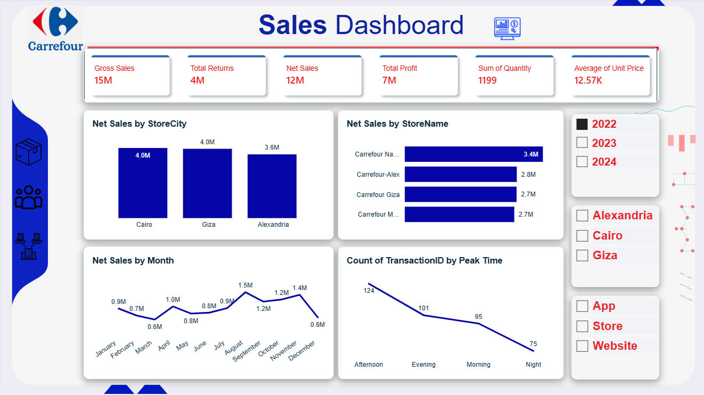
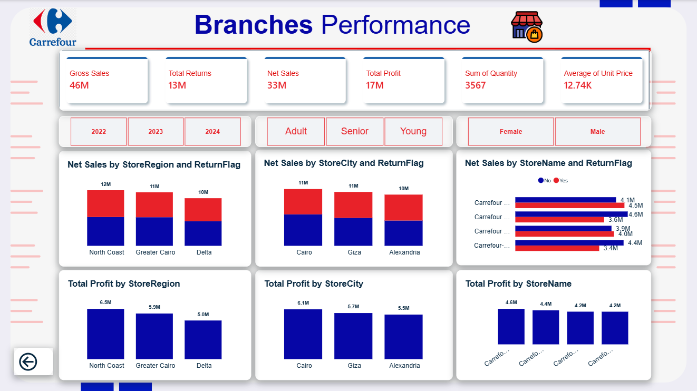
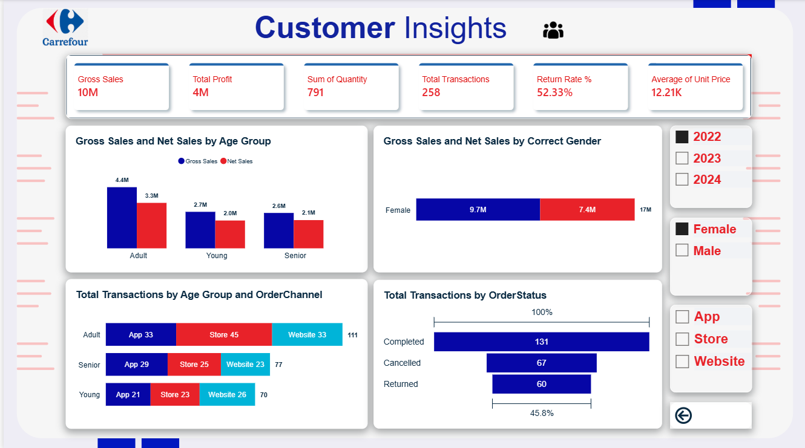
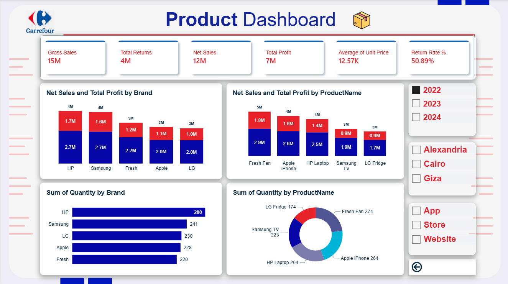

# Carrefour Retail Performance Dashboard

An interactive Power BI dashboard designed to analyze Carrefour retail performance across sales, products, customers, and branches.

The project started with a raw dataset that required data cleaning and preparation before analysis. The final dashboard provides interactive insights into sales performance, customer behavior, product performance, branch performance, and return rates.

## Project Overview

An interactive Power BI dashboard designed to analyze Carrefour retail performance across **sales, products, customers, and branches**.

The project started with a raw dataset that required data cleaning and preparation before analysis. The final dashboard provides interactive insights into **sales performance, customer behavior, product performance, branch performance, and return rates**.

**The analysis was performed using a single flat table, without a separate data model.**

## Business Questions

The analysis aims to answer the following business questions:

1. What is the overall sales and profit performance?
2. Which products and categories generate the highest sales and profit?
3. Who are the highest-value customer segments?
4. Which branches and cities have the strongest sales performance?
5. When do customers make the most transactions?
6. What is the return rate, and how does it affect net sales?
7. How does sales performance vary across different channels and time periods?

## Data Cleaning & Preparation

The raw dataset required several cleaning and preparation steps before analysis:

* **Date Correction:** Fixed inconsistencies in the date column and restructured the data to create a reliable calendar table.
* **Data Standardization:** Corrected and standardized categorical values, including the Gender column.
* **Feature Engineering:** Created age groups such as **Young, Adult, and Senior** to analyze customer behavior across different age segments.
* **Time Analysis:** Created time-of-day categories such as **Morning, Afternoon, and Evening** to identify peak transaction periods.
* **Data Types:** Reviewed and corrected data types to ensure accurate calculations and visualizations.

The cleaned dataset was then used to build the interactive Power BI dashboard.

## Dashboard Pages

### 1. Sales Dashboard
Overview of gross sales, net sales, profit, and quantity sold, broken down by store city, store name, monthly trend, and peak transaction time (morning/afternoon/evening/night).

### 2. Branches Performance
Compares the three store regions (North Coast, Greater Cairo, Delta) and their cities/branches on net sales, returns, and profit, with year and demographic (age group, gender) filters.

### 3. Customer Insights
Analyzes customer behavior: sales by age group and gender, order channel usage by age group, and transaction status breakdown (completed / cancelled / returned) with a return rate KPI.

### 4. Product Dashboard
Breaks down sales, profit, and quantity by brand (HP, Samsung, Fresh, Apple, LG) and by individual product, filterable by year and city.

## Key Insights

The analysis revealed several important insights:

* **Return Rate:** The return rate reached **50.08%**, with Gross Sales of approximately **46M** compared to Net Sales of approximately **33M**, indicating a significant gap between gross and net sales that requires further investigation.

* **Customer Behavior:** The **Adult** customer segment generated more than **20M** in sales, making it the highest-performing age group.

* **Peak Transaction Time:** The **Afternoon** recorded the highest number of transactions, with **372 transactions**.

* **Branch Performance:** **Carrefour Maadi** recorded the highest sales performance, followed by **Carrefour Giza**, with relatively close performance across the branches.

These findings provide a clearer view of sales performance, customer behavior, and areas that may require further investigation.

## Tools & Technologies

* **Power BI** — Dashboard development and data visualization
* **Power Query** — Data cleaning and transformation
* **DAX** — Calculated measures and key performance indicators
* **Excel** — Data source and initial data preparation

## Screenshots

### Sales Dashboard

### Branches Performance

### Customer Insights

### Product Dashboard

## How to Explore

1. Download `Carrefour.pbix` and open it in [Power BI Desktop](https://www.microsoft.com/en-us/power-platform/products/power-bi/desktop) (free).
2. Use the year, gender, age group, and channel slicers on each page to filter the data interactively.
3. Navigate between pages using the back arrow / navigation buttons on each screen.

---
*Built as part of my Data Analysis & Business Intelligence learning journey.*
